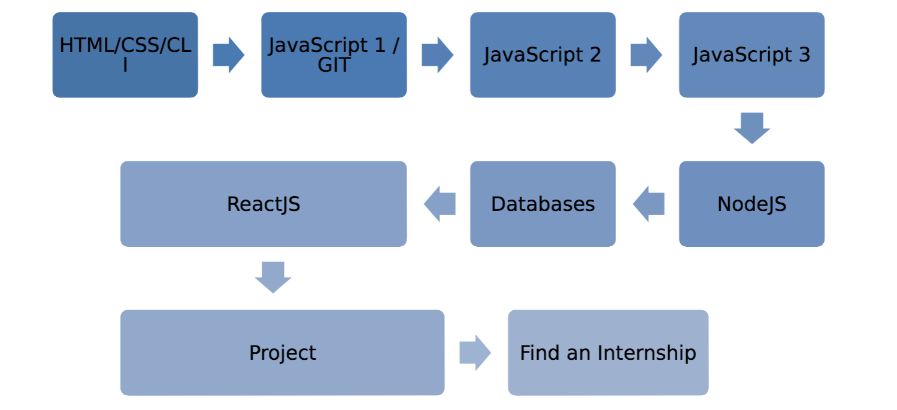
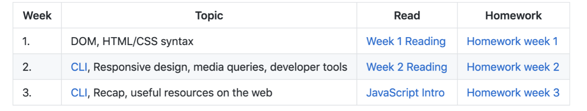

# Course Overview

During the next half year, you will practice with a variety of technologies and ways of thinking. This will build a solid foundation for you to become a junior web developer. What does this mean?

At the end of the 7 months you will leave HackYourFuture with:
* The skills to build your own full-stack web applications.
* Experience working in a team
* Access to the Alumni Network: a community of HackYourFuture graduates.
* A decent CV and LinkedIn profile coupled with interview skills
* Introductions to companies looking to hire programmers

In order for this to be turned into reality, you will have to work very hard for the next half a year.

In the following section you’ll get an overview of all the subjects you’ll be learning through the course. Keep in mind that .

### Index
1. [Curriculum](#curriculum)
1. [Homework and preparation](#homework-and-preparation)
1. [Coaches](#coaches)
1. [Start your career](#start-your-career)

---

## Curriculum

To facilitate your learning, we have developed a curriculum, which you can find here: https://curriculum.hackyourfuture.be.

The 7 months are divided into different modules, each building on the one before. Here’s the overview:
1. _HTML/CSS​:_ This is the foundation. Every website you know ultimately consists of these two technologies. You will learn how to create simple web pages (HTML) and how to make them look nice (CSS).
2. _Command Line​:_ This is the direct communication channel between you, the developer, and the computer. While most people use computers using nice icons and beautiful displays, here you will learn how to make things happen by directly executing commands.
3. _Version control with GIT:_ Writing code is a complex, especially if you’re working in multiple files. This is where version control comes in: how to save your workspace at any moment, in case you or someone from your team messes things up.  You will learn how to always keep track of the code changes you’re making
and undo your work whenever needed.
4. _JavaScript:_ The language of the web. You will learn the basics of programming, how to add interactivity to your web pages and how to make use of other services (GitHub, Google, etc.)
5. _Node.js:_ Software that allows us to use JavaScript outside the browser to create all kinds of applications. You will learn the basics of Node.js in order to understand and build web servers, which will allows us to create complex and dynamic web applications.
6. _Database - MySQL:_ The world’s most popular open-source database. Every application needs a secure place to store sensitive data, so for that we use a database. You will learn the query language SQL in order to store and retrieve your data from your own database.
7. _React.js:_ Currently the most popular way to create fast and dynamic user interfaces. In this module you will learn how to build a more modern and dynamic frontend that changes depending on what the user does.
8. _Project:_ This is where all your knowledge and experience are put to the test. You will be working on a real projects for a real client.

<!--  -->

[TOP](#course-overview)

---

## Homeworks and Preparation

As mentioned, our complete curriculum can be found on ​[Github​](https://github.com/HackYourFutureBelgium). The modules are ordered sequentially.

The homework can be found in the module repository. The main README.md will contain links to each week's _prep work_, _lesson plan_ and _assignments_.  You'll also find a collection of helpful links inclulding example projects, practical info & a link to https://study.hackyourfuture.be.

<!--  -->

After the first couple of weeks, this is also where you will publish your homework. In the beginning you might struggle to use Github. But there is a reason we use it: It is the number 1 platform for programmers! To become a good programmer, means you will have to understand how Github works. You will notice that after a few weeks, finding the right homework assignments and reading and pushing your code to Github, will become automatic.

You are expected to ​always​ come prepared to the class on Sunday. Every week you will have homework assignments and we expect you to finish them ​before​ our teaching day. The sooner you hand them in, the more time your teacher has to check your homework and give you feedback.

Handing in homework without proper communication ​will not be tolerated​ (see also our values in chapter 5). We have a simple policy on this: 3 strikes and you are out.

[TOP](#course-overview)

---

## Coaches

HackYourFuture is only possible because of our amazing team of volunteer coaches. Our coaches are medior and senior software developers working at small and big companies. They usually have very busy jobs and still want to spend their limited free time ​helping you​ to become a developer. Why?

_Value their time. Give them energy and make them proud._

[TOP](#course-overview)

---

## Start your career

After graduation, it is time to find an internship. This internship almost always leads to a paid job. HackYourFuture mentors & the team will do their best to find suitable companies for you, as we have an extensive network of partner companies.
**However, finding work will depend completely on your own efforts.**
Finding an internship consists of the following steps:
1. _CV and LinkedIn Support:_ During the project-phase we will contact you and work together to make sure you have a professional CV and LinkedIn profile ready in English.
2. _Career Training (1 session):_ Right after graduation, we have a one-day career training in which we discuss the basics of finding an internship, how to prepare for interviews, salary negotiations etc.
3. _Practice Interview (1 session):_ Two interviewers will test your social and technical skills (60-90 minutes). After this, you receive feedback about your performance. This will make you less nervous and prepare you for real interviews with companies.
4. _Improve your technical skills:_ One of the biggest risks is to stop coding after graduation. This will significantly​ decrease your chances of finding an internship. Therefore, we encourage you to continue coding within the HYF-community, with support from other alumni and coaches, to develop your skills.
5. _Finding internship possibilities:_ We will share job opportunities with you. We will train you to find leads for companies that are hiring developers. You will share these contacts with us and we will contact these companies (our experience has taught us this works better than if you contact companies yourself). In addition, we also have a network of partners of our own, which we will use to introduce you to companies.

> IMPORTANT​: Finding an internship opportunity is a two-way street. While we reach out to many different companies, you need to contribute. You can control your chances of getting an internship by working on your technical and communication skills, and provide us with leads to companies.

[TOP](#course-overview)

___
___
### <a href="https://hackyourfuture.be" target="_blank"></img></a>
