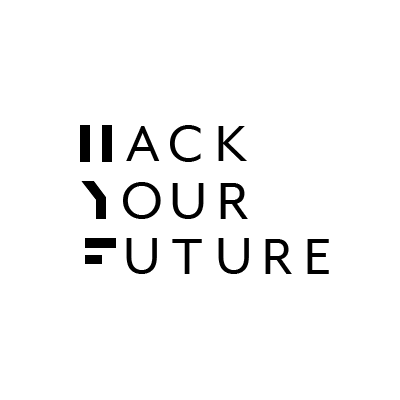

# Student Guidebook

* [Introduction](#introduction)
* [Table of contents](#table-of-contents)
* [Final thoughts](#final-thoughts)

---

## Introduction

Dear new student of HackYourFuture, Welcome to our community!

On average, we receive 100-150 applications for every new class. Therefore, to be accepted into HackYourFuture is a big accomplishment.

You are now a member of a growing community and our course will be challenging. For the next 7 months there will be moments in which you might want to give up. It is important to remember that you are not the first to go through this. Many of our students, who are now in professional jobs, have at some point thought about quitting our course.

Based on their experiences we compiled this guide to share the lessons learned: How do you make sure to be successful in HackYourFuture?

This guide consists of five chapters. 
* Chapter one lays out HackYourFuture’s core values.
* Chapter 2 provides an answer to the question: What will I learn at HackYourFuture? 
* Chapter 3 discusses the six steps of problem solving, the core skill of what programming is really all about. 
* Chapter 4 answers the question how to study programming most effectively. 
* Chapter 5 shows you how to learn asking questions, which is vital to become a good programmer.

Good luck on your journey!

PS. Like you, this document is always improving. If you feel something is missing or might be improved, please send a pull request or open an issue.

__The HackYourFuture team__

---

## Table of Contents

1. [Core Values](./00-core-values.md)
1. [Course Overview](./01-course-overview.md) 
1. [How to study programming](./02-how-to-study-programming.md) (tips for non-programmers)
1. [Study Strategies](./03-study-strategies.md)
1. [How to ask Questions](./04-how-to-ask-questions.md)

---

## Final thoughts 

Throughout you HYF course and you overall career as a programmer, you will ‘control your own fate’. 30 hours of study is just the minimum we suggest. The more you know and the harder you work, the faster you will find yourself in a job you love. The more you participate and become part of the HYF community, the more people are going to be willing to help you out. The more friends you make.

We want to provide you with the knowledge, tools and support you need to build a career as a programmer. To support yourself and your loved ones.

This is not a race against the curriculum or a race against other students. This is a race against yourself, so be sure to come up first every time, every day.
We are glad to have you on board!

___
___
### <a href="https://hackyourfuture.be" target="_blank"></img></a>
